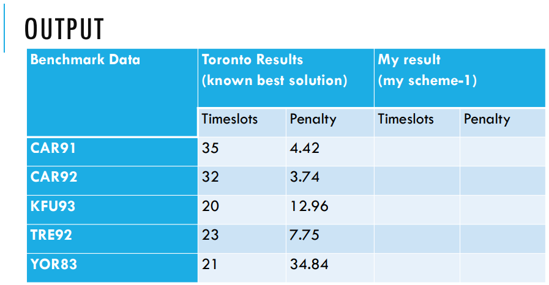
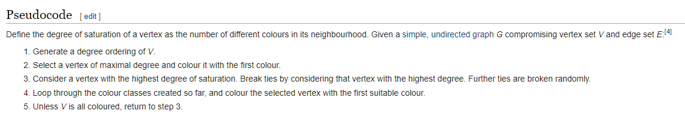

# General Discussion:
Kichu course ase, ar kichu student ase, student ra tader iccha moto course e
enroll korse, k kon course e enroll korse sheta amader jana ase, and kon course
e koyjon student ase, shetao bola ase. ekhon emon vabe exam schedule korte hobe
jate kore common student wala 2 ba totodhik course er exam date same na hoy and 
student ra jate shobcheye beshi khushi thake, khushi thakbe jodi tader exam gulor
majhe gap beshi thake. Gap joto beshi, toto beshi khushi, toto penalty kom (upto
a limit). So etake amra graph coloring problem e convert korte pari. Course gula 
holo node. Jei course gular moddhe common student ase, shegular moddhe edge diye 
dibo. Then algorithm chalay dibo. Target holo, joto kom shomvob color e color 
kora jay, then penalty minimize kora.  
Amra nijer moto heuristic choose korbo, chaile nije ekta heuristic banabo :grin:.
Amra jei jei scheme diye korsi, shobgular jonno ekta alada column thakbe and also
oi scheme er slot count koto hole, penalty 0 hoy, sheta arekta alada column e dekhate 
pari.

### penalty: 
      gap    penalty
       1       16
       2       8
       3       4
       4       2
       5       1
       ...     0

Day - 0 -> slot 0  
Day - 1 -> slot 1  
...  
Day - *i* -> slot *i*  
_______________________________________

## Example:
      Student       Courses
         1          (301, 302)
         2          (303)
         3          (301, 302)

### Assigning Exams:

### way 1:
      Day/Slot         Exam
         0          (301, 303)  
         1             (302)  

### penalty: 
    student     penalty
       1          16
       2           0
       3          16 
**total slots  :  2**   
**total penalty: 32**  

### way 2:
      Day/Slot         Exam
         0          (301, 303)
         1           [empty]  
         2            (302)  

### penalty: 
    student     penalty
       1           8
       2           0
       3           8  
**total slots  :  3**   
**total penalty: 16**  

# Solution Scheme:

## Constructive Heuristics:

Jei algorithm use kore amra ekta solution construct korbo, ei khetre ekta valid 
coloring korbo.
### Heuristics:
 - **Largest Degree:**  
    Shobcheye beshi degree wala take age color korbo (minimum jei color diye 
    kora jabe). eikhetre static node ordering hoilo, mane ki? mane hoilo coloring 
    shuru korar agei amra kon order e vertex color korbo, sheta janbo, sheta static 
    thakbe, change hobe na.
 - **DSatur:**  
    **Saturation of a Vertex:** Highest number of colours in a vertice's neighbourhood.
    
    Eta dynamic node ordering kore. Mane holo, color kora shuru korar agei amra 
    full ordering ta jante parbo na, algorithm er majhe decide hobe kontar por 
    konta color korbo.
 - **Largest Enrollment:**  
    The largest number of students registered for the examinations is scheduled 
    first.
 - **Larget Weighted Degree:**  
    The examination with the largest number of students whoare involved in the 
    conflict is scheduled first.
 - **Random Ordering:**  
    :3

## Perturbative Heuristics:

Constructive heuristics theke amra ekta solution paisi, ekhon shei solution ta to
most probably best solution na. Tai amra ekhon cheshta korbo emon solution ta k
emon vabe change korbo, jate kore solution ta still feasible thake, but coloring
e hoyto ektu change hoy. Then abar penalty calculate kore dekhbo j asholei kono
improve hoise kina. Hoile to valo, na hoile nai... (Local search korbo arki).

### Heuristics:

 - **Kempe-chain Interchange:**  
    For better understanding: go to https://core.ac.uk/download/pdf/151210222.pdf and 
    search "kempe".  
    ekta vertex choose korbo, let u be the name, then oi vertex er neighbour der
    moddhe ekta vertex v choose korlam, eta sure je tader color different, as amra
    agei constructive heuristic apply kore solution ber korsi. ebar just u er color
    ar u er neighbour der moddhe jader color v er color er same, swap korbo. 
    color swap kore dibo, then ekta inconsistensy ashte pare v er neighbour ar v 
    er moddhe, tai jekhane inconsistensy ashbe shekhane abar swap korbo...evabe 
    cholte cholte ek shomoy theme jabe. tahole finally jei solution e ashlam,
    shetao arekta valid solution, ekhon kotha hocche amar penalty ki komlo ki na...
    kempe(u, c[u], j) mane holo u er color c[u] ke er neighbour der ekta color
    j dara swapping korte thakle, j chain ta pabo, tar length koto hobe.
 - **Pair Swap Operator:**  
    Same color er vertex gula k ekta color class hishebe chinta kori. emon 2 ta 
    color class er color swap kore dibo, jate solution feasible thake. emon 2 ta 
    color class swap korte parle, len(kempe(u,c[u],c[v])) = len(kempe(v,c[v],c[u])) = 1
    hobe, which implies that pair swap kore amara solution ta feasible ase, as 
    kempe korle solution feasible thakei and color swapping kora mane 2 ta kempe 
    mara... (uporer link tay giye "Pair-swap Operator" likhe search koro).

## SWO (Squeaky Wheel Optimization):

We describe a general approach to optimization which we term "Squeaky Wheel" Optimization 
( SWO). In SWO, a greedy algorithm is used to construct a solution which is then 
analyzed to find the trouble spots, i.e., those elements, that, if improved, are 
likely to improve the objective function score. The results of the analysis are 
used to generate new priorities that determine the order in which the greedy 
algorithm constructs the next solution. This Construct/Analyze/Prioritize cycle 
continues until some limit is reached, or an acceptable solution is found.
Source: https://www.cs.cmu.edu/afs/cs/project/jair/pub/volume10/joslin99a-html/swo.html
    

    

